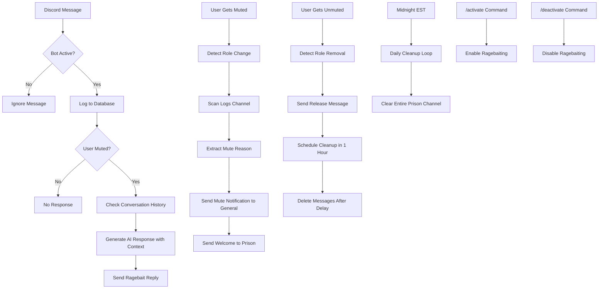
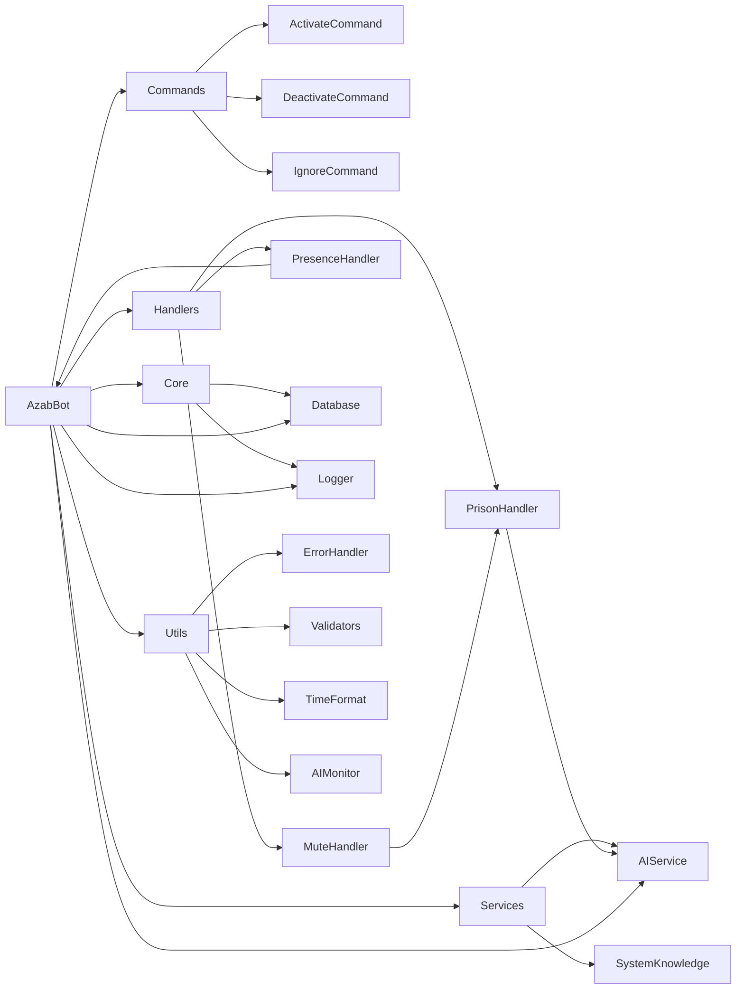

# 🔥 AzabBot - AI-Powered Discord Prison Bot

<div align="center">


**A sophisticated Discord bot designed for psychological warfare against muted users**

*Built specifically for discord.gg/syria*

[](https://discord.gg/syria)

[Features](#-features) • [Installation](#-installation) • [Configuration](#-configuration) • [Usage](#-usage) • [Architecture](#-architecture)

</div>

---

## 🎯 Overview

**AzabBot** is a custom-built Discord bot that specializes in advanced psychological warfare against muted users. Unlike traditional moderation bots, AzabBot doesn't mute users - it **ragebaits** them after they've already been muted by other systems.

### ⚠️ **Important Notice**
This bot was custom-built for **discord.gg/syria** and is provided as-is for educational purposes. **No support will be provided** for setup, configuration, or troubleshooting.

### 🆕 **Latest Features**
- **🔄 Daily Prison Cleanup**: Automatic channel cleanup at midnight to keep prison fresh
- **💬 Enhanced Message Context**: Tracks last 10 messages per user for better AI roasting
- **⏰ Delayed Message Cleanup**: 1-hour delay before deleting released prisoner messages
- **🎭 Dynamic Rich Presence**: 14 rotating status messages showing bot activity
- **📊 Prisoner Statistics**: Complete mute history tracking and analytics
- **🧠 AI-Powered Responses**: GPT-4 contextual roasting with conversation history
- **👨‍👩‍👦 Family Recognition**: Special responses for developer and family members
- **🔒 Instance Lock**: Prevents duplicate bot processes system-wide

---

## ✨ Features

### 🧠 **AI-Powered Ragebaiting**
- **OpenAI GPT-4 Integration**: Contextual, creative responses to muted users
- **10-Message Context**: Tracks conversation history for better roasting
- **Adaptive Responses**: Different styles based on user status and behavior
- **Trigger Message Awareness**: References the actual message that caused the mute
- **Contradiction Detection**: AI calls out inconsistencies in user's statements
- **Pattern Recognition**: Identifies begging, excuses, anger patterns
- **Fallback System**: Works even without AI service

### 🏰 **Prison Management System**
- **Automatic Welcomes**: Savage welcome messages for new prisoners with mute context
- **Daily Cleanup**: Automatic midnight channel cleanup to keep prison fresh
- **Delayed Message Deletion**: 1-hour delay after unmute before cleanup
- **Channel Integration**: Monitors logs channel for mute information
- **Prisoner History**: Tracks repeat offenders with comprehensive statistics
- **Enhanced Roasting**: Special messages for users with multiple prison visits
- **Trigger Message Storage**: Saves the message that led to each mute
- **Accurate Duration Tracking**: Shows exact time served for current session

### 🔍 **Advanced Mute Detection**
- **Role-Based Detection**: Monitors for muted role assignments
- **Timeout Monitoring**: Tracks Discord timeout status changes
- **Embed Processing**: Extracts mute reasons from moderation bot embeds
- **Real-Time Tracking**: Instant detection of new prisoners
- **General Chat Notifications**: Announces mutes in general chat with AI mockery

### 🎮 **Dynamic Rich Presence**
- **14 Rotating Messages**: Creative emoji-first status variations
- **Active Mode**: 👁️ Watching, 😈 Torturing, 🔥 Roasting, 💀 Destroying, etc.
- **Idle Mode**: 💤 Napping, 😴 Off duty, 🌙 Resting, 💭 Dreaming, etc.
- **Stats Display**: Shows prison statistics (mutes, days served, record holder)
- **Emergency Mode**: 🚨 Mass arrest status when 5+ prisoners appear
- **Release Notifications**: Shows username and time served when freed
- **Auto-Updates**: Presence refreshes every 30 seconds

### 👨‍👩‍👦 **Family Recognition System**
- **Developer (Dad)**: Gets intelligent ChatGPT-like responses with full access
- **Uncle Support**: Uncle Zaid gets respectful yet friendly responses
- **Brother Support**: Brother Ward gets casual sibling interactions
- **Bypass Restrictions**: Family members work even when bot is deactivated
- **Unique Relationships**: Each family member has personalized response style
- **Ping Requirement**: Family must mention bot to get responses

### 🧠 **AI Self-Awareness System**
- **Strong Identity**: Bot owns its identity as Azab, never says "I am just an AI"
- **Complete Codebase Knowledge**: Bot knows its entire architecture
- **Feature Explanations**: Can explain any feature or system in detail
- **Technical Question Detection**: Automatically provides accurate information
- **System Knowledge Module**: Comprehensive documentation integrated into AI
- **Confident Personality**: Responds as a real entity, not a scripted bot

### 📊 **Analytics & Logging**
- **Message Tracking**: Logs all user interactions to SQLite database
- **Prisoner History**: Complete database of all mute events with timestamps
- **Run ID System**: Unique session tracking for debugging
- **Structured Logging**: Professional logging with EST timezone
- **Performance Monitoring**: Tracks bot performance and errors
- **Persistent State**: Saves activation state to survive restarts

### 🛡️ **Security & Validation**
- **Input Validation**: All user inputs validated against Discord limits
- **SQL Injection Prevention**: Parameterized queries and input sanitization
- **Error Context Capture**: Comprehensive error tracking with recovery suggestions
- **Discord ID Validation**: Ensures valid Discord IDs (17-19 digits)
- **Message Content Limits**: Enforces 2000 character Discord message limit
- **Username Validation**: Checks 32 character username limit
- **Instance Lock Mechanism**: Prevents duplicate bot processes system-wide

### 📈 **AI Usage Monitoring**
- **Real-Time Token Tracking**: Actual OpenAI API usage from response data
- **Cost Calculation**: Automatic pricing based on GPT-4 rates
- **Usage Statistics**: Daily, monthly, and all-time tracking
- **Response Metrics**: Shows generation time and tokens used
- **Data Persistence**: Usage data saved to JSON for analysis
- **Session Tracking**: Monitor current session usage

### 🎮 **Command System**
- **Slash Commands**: Modern Discord slash command interface
- **/activate**: Enable ragebaiting mode
- **/deactivate**: Disable ragebaiting mode
- **/ignore**: Ignore/unignore specific users
- **Permission Management**: Command permissions managed via Discord integrations
- **Ephemeral Responses**: Private command confirmations
- **Developer Override**: Creator bypasses all restrictions

---

## 🚀 Installation

### Prerequisites
- Python 3.12+ (Note: 3.13 not supported due to audioop removal)
- Discord Bot Token
- OpenAI API Key (optional but recommended)

### Quick Setup

1. **Clone the repository**
```bash
git clone https://github.com/trippixn963/AzabBot.git
cd AzabBot
```

2. **Create virtual environment**
```bash
python -m venv venv
source venv/bin/activate  # On Windows: venv\Scripts\activate
```

3. **Install dependencies**
```bash
pip install -r requirements.txt
```

4. **Configure environment**
```bash
cp .env.example .env
# Edit .env with your configuration
```

5. **Run the bot**
```bash
python main.py
```

---

## ⚙️ Configuration

### Environment Variables

Create a `.env` file in the project root:

```env
# Discord Configuration
DISCORD_TOKEN=your_discord_bot_token
DEVELOPER_ID=your_discord_user_id
DEVELOPER_NAME=حَـــــنَّـــــا
UNCLE_ID=uncle_discord_user_id
BROTHER_ID=brother_discord_user_id

# OpenAI Configuration (Optional but recommended)
OPENAI_API_KEY=your_openai_api_key

# Channel Configuration
LOGS_CHANNEL_ID=channel_id_for_moderation_logs
PRISON_CHANNEL_ID=channel_id_for_prison_messages
GENERAL_CHANNEL_ID=channel_id_for_release_messages

# Role Configuration
MUTED_ROLE_ID=role_id_for_muted_users

# Bot Behavior Settings
PRISONER_COOLDOWN_SECONDS=10
AI_MAX_TOKENS=150
AI_TEMPERATURE_MUTED=0.95
PRESENCE_UPDATE_INTERVAL=30
PRESENCE_EVENT_DURATION=5
PRISON_CLEANUP_HOUR=0
TIMEZONE_OFFSET_HOURS=-5
```

### Discord Bot Setup

1. **Create Discord Application**
   - Go to [Discord Developer Portal](https://discord.com/developers/applications)
   - Create new application
   - Go to "Bot" section and create bot
   - Copy the token to your `.env` file

2. **Set Bot Permissions**
   - Enable "Message Content Intent"
   - Enable "Server Members Intent"
   - Enable "Reactions Intent" (for reaction management)
   - Add bot to your server with appropriate permissions

3. **Configure Channels**
   - Set up logs channel for moderation bot embeds
   - Create prison channel for ragebaiting
   - Create muted role for user detection

---

## 🖼️ Visual Demo

<div align="center">

### Bot in Action


*The AzabBot ready to engage in psychological warfare*

</div>

---

## 🎮 Usage

### Basic Commands

| Command | Description | Access |
|---------|-------------|--------|
| `/activate` | Enable ragebaiting mode | Configurable via Discord |
| `/deactivate` | Disable ragebaiting mode | Configurable via Discord |
| `/ignore` | Ignore or unignore a specific user | Configurable via Discord |

### Bot Behavior

**When Active:**
- Monitors all messages for muted users
- Generates AI responses to muted users only
- Welcomes new prisoners with contextual messages
- Logs all interactions for analytics
- Daily prison cleanup at midnight

**When Inactive:**
- Stays connected but doesn't respond
- Continues monitoring for new mutes
- Maintains database logging
- Daily cleanup still runs

### Example Interactions

```
User (muted): "This is so unfair!"
AzabBot: "Imagine getting muted and still complaining 😂 Welcome to prison, enjoy your stay! 🔒"

User (muted): "I didn't do anything wrong"
AzabBot: "That's what they all say in jail 💀 Maybe next time don't spam the chat?"

User (released after 2 days):
AzabBot: "Look who finally got out! Think you learned your lesson this time? 🤔"
```

---

## 🏗️ Architecture

### Project Structure

```
AzabBot/
├── src/
│   ├── bot.py                 # Main bot class and event handlers
│   ├── commands/
│   │   ├── activate.py        # /activate command
│   │   ├── deactivate.py      # /deactivate command
│   │   └── ignore.py          # /ignore command
│   ├── core/
│   │   ├── database.py        # SQLite database wrapper
│   │   └── logger.py          # Custom logging system
│   ├── handlers/
│   │   ├── prison_handler.py  # Prisoner welcome/release + daily cleanup
│   │   ├── mute_handler.py    # Mute embed processing
│   │   └── presence_handler.py # Dynamic rich presence updates
│   ├── services/
│   │   ├── ai_service.py      # OpenAI integration
│   │   └── system_knowledge.py # Bot self-awareness system
│   └── utils/
│       ├── error_handler.py   # Error handling utilities
│       ├── time_format.py     # Time formatting
│       ├── validators.py      # Input validation
│       ├── ai_monitor.py      # AI usage tracking
│       └── version.py         # Version management
├── images/                    # Bot images and assets
├── logs/                      # Daily log files
├── .env                       # Environment configuration
├── main.py                    # Application entry point
└── requirements.txt           # Python dependencies
```

### Core Components

**AzabBot Class**
- Main Discord client with event handlers
- Mute detection and prison management
- AI response coordination
- Rich presence management

**Handlers**
- **PrisonHandler**: Manages prisoner welcome/release + daily cleanup loop
- **MuteHandler**: Processes mute embeds and extracts reasons
- **PresenceHandler**: Manages dynamic Discord rich presence

**AIService**
- OpenAI GPT-4 integration
- Contextual response generation
- 10-message conversation history
- Fallback response system

**Database**
- SQLite for message logging
- User statistics tracking
- Prisoner history with mute reasons
- Async database operations

**Logger**
- Custom logging with run IDs
- EST timezone support
- Daily log rotation
- Tree-style structured logs

### Bot Workflow Diagram



### System Architecture



---

## 🔧 Technical Details

### Dependencies

- **discord.py**: Discord API wrapper
- **openai**: AI response generation (GPT-4)
- **python-dotenv**: Environment management
- **aiohttp**: Async HTTP client

### Performance Features

- **Async Operations**: Non-blocking database and API calls
- **Connection Pooling**: Efficient database connections
- **Error Handling**: Comprehensive error recovery
- **Resource Management**: Proper cleanup and shutdown
- **Message Context**: 10-message history using deque
- **Background Tasks**: Daily cleanup and presence updates

### Security Features

- **Permission Management**: Via Discord integrations
- **Input Validation**: Safe message processing
- **SQL Injection Prevention**: Parameterized queries
- **Rate Limiting**: Prevents API abuse
- **Secure Configuration**: Environment-based secrets
- **Instance Locking**: Prevents duplicate processes

---

## 📈 Monitoring & Analytics

### Logging System

- **Run ID Tracking**: Each session gets unique identifier
- **Tree-Style Logs**: Professional structured logs with emojis
- **Daily Rotation**: Automatic log file management by date
- **EST Timezone**: Consistent timezone handling with DST support
- **Error Tracking**: Comprehensive error logging with context
- **Performance Metrics**: Bot performance and API monitoring

### Database Schema

```sql
-- Users table
CREATE TABLE users (
    user_id INTEGER PRIMARY KEY,
    username TEXT,
    messages_count INTEGER DEFAULT 0,
    is_imprisoned BOOLEAN DEFAULT 0
);

-- Messages table
CREATE TABLE messages (
    id INTEGER PRIMARY KEY AUTOINCREMENT,
    user_id INTEGER,
    content TEXT,
    channel_id INTEGER,
    guild_id INTEGER,
    timestamp TIMESTAMP DEFAULT CURRENT_TIMESTAMP
);

-- Prisoner history table
CREATE TABLE prisoner_history (
    id INTEGER PRIMARY KEY AUTOINCREMENT,
    user_id INTEGER,
    username TEXT,
    mute_reason TEXT,
    trigger_message TEXT,
    muted_at TIMESTAMP DEFAULT CURRENT_TIMESTAMP,
    unmuted_at TIMESTAMP,
    duration_minutes INTEGER,
    muted_by TEXT,
    unmuted_by TEXT,
    is_active BOOLEAN DEFAULT 1
);
```

---

## ⚠️ Disclaimer

**This bot is provided for educational and entertainment purposes only.**

- **No Support**: This is a custom bot with no support provided
- **Use at Own Risk**: Not responsible for any consequences
- **Server-Specific**: Built for discord.gg/syria, may not work elsewhere
- **Moderation Tool**: Designed to work alongside existing moderation systems

---

## 👨‍💻 Author

<div align="center">


**حَـــــنَّـــــا** - Custom Discord Bot Developer

*Built with ❤️ for discord.gg/syria*

</div>

---

<div align="center">

**⭐ Star this repository if you find it useful!**

[Report Bug](https://github.com/trippixn963/AzabBot/issues) • [Request Feature](https://github.com/trippixn963/AzabBot/issues) • [Discord Server](https://discord.gg/syria)

</div>
