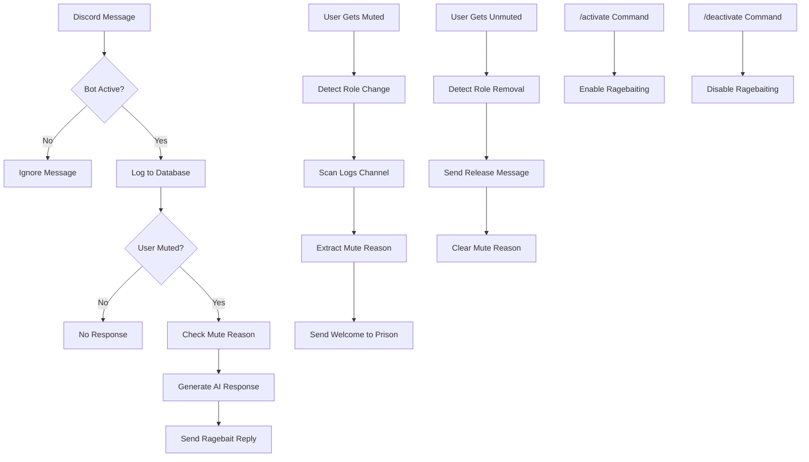
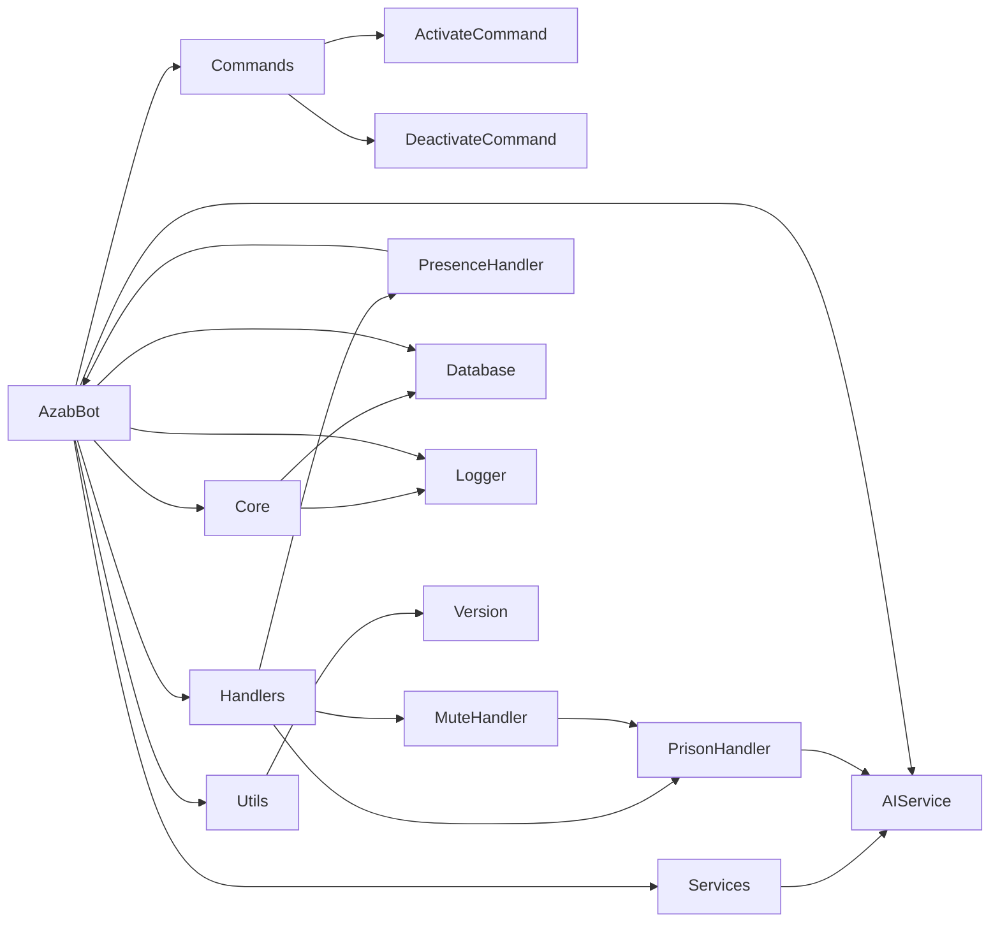

# 🔥 Azab - Advanced Discord Prison Bot

<div align="center">


**A sophisticated Discord bot designed for psychological warfare against muted users**

*Built specifically for discord.gg/syria*

[](https://discord.gg/syria)

[Features](#-features) • [Installation](#-installation) • [Configuration](#-configuration) • [Usage](#-usage) • [Architecture](#-architecture)

</div>

---

## 🎯 Overview

**Azab** is a custom-built Discord bot that specializes in advanced psychological warfare against muted users. Unlike traditional moderation bots, Azab doesn't mute users - it **ragebaits** them after they've already been muted by other systems.

### ⚠️ **Important Notice**
This bot was custom-built for **discord.gg/syria** and is provided as-is for educational purposes. **No support will be provided** for setup, configuration, or troubleshooting.

### 🆕 **What's New in v2.4.0**
- **🧠 AI Self-Awareness**: Bot knows everything about its own architecture and features
- **👨‍👩‍👦 Family System**: Special privileges for dad, uncle, and brother with unique responses
- **📝 Trigger Message Tracking**: Saves the message that caused each mute
- **📊 Advanced Database Queries**: Real-time prison statistics and user lookups
- **⏱ Response Time Display**: Shows AI generation time in small text (⏱ 0.87s)
- **🔒 Status Shows Mute Reason**: Bot presence displays username and mute reason
- **🎯 Ping Requirement**: Family members must mention bot for responses
- **⏰ Accurate Time Tracking**: Fixed "0m" issue for release messages

---

## ✨ Features

### 🧠 **AI Self-Awareness System** ⭐ *NEW v2.4.0*
- **Complete Codebase Knowledge**: Bot knows its entire architecture and implementation
- **Feature Explanations**: Can explain any feature or system in detail
- **Technical Question Detection**: Automatically provides accurate technical information
- **System Knowledge Module**: Comprehensive documentation integrated into AI

### 👨‍👩‍👦 **Family Recognition System** ⭐ *NEW v2.3.0*
- **Developer (Dad)**: Gets intelligent ChatGPT-like responses with full access
- **Uncle Support**: Uncle Zaid gets respectful yet friendly responses
- **Brother Support**: Brother Ward gets casual sibling interactions
- **Bypass Restrictions**: Family members work even when bot is deactivated
- **Unique Relationships**: Each family member has personalized response style
- **Ping Requirement**: Family must mention bot to get responses (v2.4.0)

## ✨ Core Features

### 🧠 **AI-Powered Ragebaiting**
- **OpenAI Integration**: Uses GPT-3.5-turbo for contextual, creative responses
- **Contextual Mocking**: References specific mute reasons and user messages
- **Adaptive Responses**: Different response styles based on user status
- **Response Time Tracking**: Shows generation time in Discord small text format
- **Trigger Message Awareness**: Uses the actual message that caused the mute
- **Fallback System**: Works even without AI service

### 🔍 **Advanced Mute Detection**
- **Role-Based Detection**: Monitors for muted role assignments
- **Timeout Monitoring**: Tracks Discord timeout status changes
- **Embed Processing**: Extracts mute reasons from moderation bot embeds
- **Real-Time Tracking**: Instant detection of new prisoners

### 🏰 **Prison Management System**
- **Automatic Welcomes**: New prisoners get savage welcome messages
- **Channel Integration**: Monitors logs channel for mute information
- **Prison Channel**: Dedicated space for ragebaiting activities
- **Contextual Responses**: Uses actual mute reasons for maximum impact
- **Prisoner History**: Tracks repeat offenders with comprehensive mute statistics
- **Enhanced Roasting**: Special messages for users with multiple prison visits
- **Trigger Message Storage**: Saves the message that led to each mute
- **Accurate Duration Tracking**: Shows exact time served for current session
- **Database Queries**: "Who is the most muted?", "Current prisoners", user lookups

### 🎮 **Dynamic Rich Presence**
- **Real-Time Status**: Shows current prisoner count when active
- **Activity Updates**: Displays "Watching X prisoners" during ragebaiting
- **Event Notifications**: Special presence updates for prisoner arrivals/releases
- **Mute Reason Display**: Shows "🔒 Username: reason" when someone gets muted
- **Sleep Mode**: Shows "💤 Sleeping" when bot is inactive
- **Auto-Updates**: Presence refreshes every 30 seconds
- **Live Feedback**: See bot activity directly in Discord status

### 📊 **Analytics & Logging**
- **Message Tracking**: Logs all user interactions to SQLite database
- **Prisoner History**: Complete database of all mute events with timestamps
- **Run ID System**: Unique session tracking for debugging
- **Structured Logging**: Professional logging with EST timezone
- **Performance Monitoring**: Tracks bot performance and errors
- **Persistent State**: Saves activation state to survive restarts

### 🎮 **Command System**
- **Slash Commands**: Modern Discord slash command interface
- **Admin Controls**: `/activate` and `/deactivate` commands
- **Permission System**: Administrator-only access to controls
- **Ephemeral Responses**: Private command confirmations
- **Developer Override**: Creator bypasses all restrictions and deactivation

---

## 🚀 Installation

### Prerequisites
- Python 3.12 (Note: 3.13 not supported due to audioop removal)
- Discord Bot Token
- OpenAI API Key (optional but recommended)

### Quick Setup

1. **Clone the repository**
```bash
git clone https://github.com/yourusername/azab-discord-bot.git
cd azab-discord-bot
```

2. **Create virtual environment**
```bash
python -m venv venv
source venv/bin/activate  # On Windows: venv\Scripts\activate
```

3. **Install dependencies**
```bash
pip install -r requirements.txt
```

4. **Configure environment**
```bash
cp .env.example .env
# Edit .env with your configuration
```

5. **Run the bot**
```bash
python main.py
```

---

## ⚙️ Configuration

### Environment Variables

Create a `.env` file in the project root:

```env
# Discord Configuration
DISCORD_TOKEN=your_discord_bot_token
DEVELOPER_ID=your_discord_user_id
UNCLE_ID=uncle_discord_user_id  # Optional
BROTHER_ID=brother_discord_user_id  # Optional

# OpenAI Configuration (Optional but recommended)
OPENAI_API_KEY=your_openai_api_key

# Channel Configuration
LOGS_CHANNEL_ID=channel_id_for_moderation_logs
PRISON_CHANNEL_IDS=channel_id_for_prison_messages
GENERAL_CHANNEL_ID=channel_id_for_release_messages
MUTED_ROLE_ID=role_id_for_muted_users

# Bot Behavior Settings
PRISONER_COOLDOWN_SECONDS=10
AI_MAX_TOKENS=150
AI_TEMPERATURE_MUTED=0.95
PRESENCE_UPDATE_INTERVAL=30
PRESENCE_EVENT_DURATION=5
```

### Discord Bot Setup

1. **Create Discord Application**
   - Go to [Discord Developer Portal](https://discord.com/developers/applications)
   - Create new application
   - Go to "Bot" section and create bot
   - Copy the token to your `.env` file

2. **Set Bot Permissions**
   - Enable "Message Content Intent"
   - Enable "Server Members Intent"
   - Add bot to your server with appropriate permissions

3. **Configure Channels**
   - Set up logs channel for moderation bot embeds
   - Create prison channel for ragebaiting
   - Create muted role for user detection

---

## 🖼️ Visual Demo

<div align="center">

### Bot in Action


*The Azab bot ready to engage in psychological warfare*

</div>

---

## 🎮 Usage

### Basic Commands

| Command | Description | Permission |
|---------|-------------|------------|
| `/activate` | Enable ragebaiting mode | Administrator |
| `/deactivate` | Disable ragebaiting mode | Administrator |

### Bot Behavior

**When Active:**
- Monitors all messages for muted users
- Generates AI responses to muted users only
- Welcomes new prisoners with contextual messages
- Logs all interactions for analytics

**When Inactive:**
- Stays connected but doesn't respond
- Continues monitoring for new mutes
- Maintains database logging

### Example Interactions

```
User (muted): "This is so unfair!"
Azab: "Imagine getting muted and still complaining 😂 Welcome to prison, enjoy your stay! 🔒"

User (muted): "I didn't do anything wrong"
Azab: "That's what they all say in jail 💀 Maybe next time don't spam the chat?"
```

---

## 🏗️ Architecture

### Project Structure

```
azab-discord-bot/
├── src/
│   ├── bot.py                 # Main bot class and event handlers
│   ├── commands/
│   │   ├── activate.py        # /activate command
│   │   └── deactivate.py      # /deactivate command
│   ├── core/
│   │   ├── database.py        # SQLite database wrapper
│   │   └── logger.py          # Custom logging system
│   ├── handlers/
│   │   ├── prison_handler.py  # Prisoner welcome/release management
│   │   ├── mute_handler.py    # Mute embed processing
│   │   └── presence_handler.py # Dynamic rich presence updates
│   ├── services/
│   │   └── ai_service.py      # OpenAI integration
│   └── utils/
│       ├── version.py         # Version management system
│       └── update_version.py  # Version update script
├── data/
│   └── azab.db               # SQLite database
├── logs/
│   └── azab_YYYY-MM-DD.log   # Daily log files
├── .env                      # Environment configuration
├── main.py                   # Application entry point
└── requirements.txt          # Python dependencies
```

### Core Components

**AzabBot Class**
- Main Discord client with event handlers
- Mute detection and prison management
- AI response coordination
- Rich presence management

**Handlers**
- **PrisonHandler**: Manages prisoner welcome/release messages
- **MuteHandler**: Processes mute embeds and extracts reasons
- **PresenceHandler**: Manages dynamic Discord rich presence

**AIService**
- OpenAI API integration
- Contextual response generation
- Fallback response system

**Database**
- SQLite for message logging
- User statistics tracking
- Async database operations

**Logger**
- Custom logging with run IDs
- EST timezone support
- Daily log rotation

### Bot Workflow Diagram



### System Architecture



---

## 🔧 Technical Details

### Dependencies

- **discord.py**: Discord API wrapper
- **openai**: AI response generation
- **python-dotenv**: Environment management
- **aiohttp**: Async HTTP client

### Performance Features

- **Async Operations**: Non-blocking database and API calls
- **Connection Pooling**: Efficient database connections
- **Error Handling**: Comprehensive error recovery
- **Resource Management**: Proper cleanup and shutdown

### Security Features

- **Permission Checks**: Administrator-only commands
- **Input Validation**: Safe message processing
- **Rate Limiting**: Prevents API abuse
- **Secure Configuration**: Environment-based secrets

---

## 📈 Monitoring & Analytics

### Logging System

- **Run ID Tracking**: Each session gets unique identifier
- **Structured Logs**: JSON-formatted log entries
- **Daily Rotation**: Automatic log file management
- **Error Tracking**: Comprehensive error logging

### Database Schema

```sql
-- Users table
CREATE TABLE users (
    user_id INTEGER PRIMARY KEY,
    username TEXT,
    messages_count INTEGER DEFAULT 0,
    is_imprisoned BOOLEAN DEFAULT 0
);

-- Messages table
CREATE TABLE messages (
    id INTEGER PRIMARY KEY AUTOINCREMENT,
    user_id INTEGER,
    content TEXT,
    channel_id INTEGER,
    guild_id INTEGER,
    timestamp TIMESTAMP DEFAULT CURRENT_TIMESTAMP
);

-- Prisoner history table (v2.4.0)
CREATE TABLE prisoner_history (
    id INTEGER PRIMARY KEY AUTOINCREMENT,
    user_id INTEGER,
    username TEXT,
    mute_reason TEXT,
    trigger_message TEXT,  -- Added in v2.4.0
    muted_at TIMESTAMP DEFAULT CURRENT_TIMESTAMP,
    unmuted_at TIMESTAMP,
    duration_minutes INTEGER,
    muted_by TEXT,
    unmuted_by TEXT,
    is_active BOOLEAN DEFAULT 1
);
```

---

## ⚠️ Disclaimer

**This bot is provided for educational and entertainment purposes only.**

- **No Support**: This is a custom bot with no support provided
- **Use at Own Risk**: Not responsible for any consequences
- **Server-Specific**: Built for discord.gg/syria, may not work elsewhere
- **Moderation Tool**: Designed to work alongside existing moderation systems

---

## 📄 License

This project is licensed under the MIT License - see the [LICENSE](LICENSE) file for details.

---

## 👨‍💻 Author

<div align="center">


**حَـــــنَّـــــا** - Custom Discord Bot Developer

*Built with ❤️ for discord.gg/syria*

</div>

---

<div align="center">

**⭐ Star this repository if you find it useful!**

[Report Bug](https://github.com/trippixn963/AzabBot/issues) • [Request Feature](https://github.com/trippixn963/AzabBot/issues) • [Discord Server](https://discord.gg/syria)

</div>