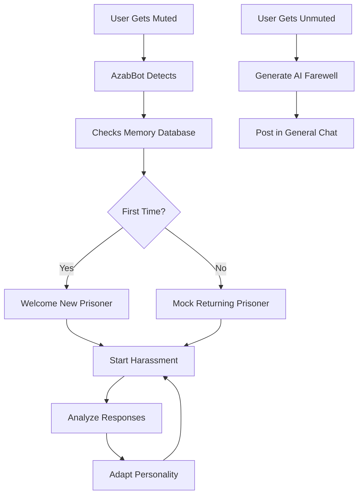

# 🔒 AzabBot - The Ultimate Prison Guard

<div align="center">
  
  
  
  
  
  **Advanced AI-Powered Prison Guard Bot for Discord**
  
  [](https://discord.gg/syria)
  [](https://www.python.org/)
  [](https://openai.com/)
  [](https://github.com/trippixn963/AzabBot)
  
  *A psychological torture specialist for your Discord server's prison channels*
  
</div>

---

## 📖 Table of Contents

- [About](#-about)
- [Features](#-features)
- [How It Works](#-how-it-works)
- [Installation](#-installation)
- [Configuration](#-configuration)
- [Commands](#-commands)
- [Bot Behavior](#-bot-behavior)
- [Technical Architecture](#-technical-architecture)
- [Personality Modes](#-personality-modes)
- [Memory System](#-memory-system)
- [FAQ](#-faq)
- [Disclaimer](#-disclaimer)

---

## 🎭 About

**AzabBot** is an advanced Discord bot designed to psychologically torment users in timeout/mute channels. Inspired by the infamous Sednaya prison, this bot acts as a confused, incompetent guard who harasses prisoners with nonsensical questions and accusations.

Originally created for the **Syria Discord Server** ([discord.gg/syria](https://discord.gg/syria)), AzabBot uses GPT-3.5 to generate contextually aware, dynamically adaptive responses that evolve based on each prisoner's behavior and history.

### Why AzabBot?

- **Automated Prison Management**: No need for moderators to manually harass muted users
- **Entertainment Value**: Turns timeouts into an interactive experience
- **Memory System**: Remembers every prisoner and their history
- **Adaptive AI**: Learns what annoys each user most

---

## ✨ Features

### 🧠 **Intelligent Memory System**
- Remembers every prisoner who enters the jail
- Tracks conversation history and behavior patterns
- Identifies returning prisoners and mentions their visit count
- Builds personality profiles for each user

### 🎭 **13 Dynamic Personality Modes**
- **Azab the Torturer**: Confused interrogator asking nonsensical questions
- **Syrian Contrarian**: Disagrees with everything
- **Philosophical Pessimist**: Makes everything depressing
- **Sarcastic Comedian**: Mocks with bad jokes
- **Historical Lecturer**: Boring history lessons
- **Conspiracy Theorist**: Everything is a plot
- **Grammar Nazi**: Corrects language obsessively
- **Tech Bro Disruptor**: Silicon Valley nonsense
- **Boomer Complainer**: "Back in my day..."
- **Zen Master Troll**: Fake wisdom and riddles
- **Political Extremist**: Makes everything political
- **Religious Debater**: Theological arguments
- **Gaslighting Expert**: "That never happened"

### 🔄 **Automatic Features**
- **Auto-Detection**: Detects when users get muted/unmuted
- **Welcome Messages**: Greets new prisoners with personalized torture
- **Release Notifications**: AI-generated sarcastic messages when unmuted
- **Presence Rotation**: Shows "Playing with [prisoner name]"
- **Always Online**: Green status dot, always watching

### 💬 **AI-Powered Responses**
- Uses GPT-3.5 for human-like confusion
- Context-aware responses based on conversation
- Adapts personality based on user reactions
- Generates unique content for each interaction

### 📊 **Advanced Analytics**
- Tracks effectiveness of different approaches
- Monitors user engagement patterns
- Counts debates won/lost
- Records ignored responses

---

## 🔧 How It Works

### The Flow


```mermaid
graph TD
    A[User Gets Muted] --> B[AzabBot Detects]
    B --> C[Checks Memory Database]
    C --> D{First Time?}
    D -->|Yes| E[Welcome New Prisoner]
    D -->|No| F[Mock Returning Prisoner]
    E --> G[Start Harassment]
    F --> G
    G --> H[Analyze Responses]
    H --> I[Adapt Personality]
    I --> G
    J[User Gets Unmuted] --> K[Generate AI Farewell]
    K --> L[Post in General Chat]
```

### Core Logic

1. **Detection Phase**
   - Monitors role changes for muted role
   - Identifies prison channel by ID
   - Checks user history in database

2. **Engagement Phase**
   - Selects personality based on user profile
   - Generates contextual responses
   - Implements 10-second cooldown between messages
   - Batches multiple messages for context

3. **Memory Phase**
   - Stores all conversations
   - Updates personality profile
   - Tracks effectiveness metrics
   - Adjusts approach for next time

---

## 🚀 Installation

### Prerequisites

- **Python 3.11+** installed
- **Discord Bot** created with token
- **OpenAI API Key** for GPT-3.5
- **Discord Server** with admin permissions

### Step-by-Step Setup

1. **Clone the Repository**
   ```bash
   git clone https://github.com/trippixn963/AzabBot.git
   cd AzabBot
   ```

2. **Install Dependencies**
   ```bash
   pip install -r requirements.txt
   ```

3. **Create Environment File**
   ```bash
   # Create .env file in root directory
   touch .env
   ```

4. **Configure Environment Variables**
   ```env
   # Discord Configuration
   DISCORD_TOKEN=your_discord_bot_token_here
   DEVELOPER_ID=your_discord_user_id
   
   # OpenAI Configuration
   OPENAI_API_KEY=your_openai_api_key_here
   
   # Prison Configuration
   TARGET_ROLE_ID=muted_role_id_here
   PRISON_CHANNEL_IDS=prison_channel_id_here
   
   # Optional Settings
   RESPONSE_PROBABILITY=70
   AI_MODEL=gpt-3.5-turbo
   MAX_RESPONSE_LENGTH=150
   ```

5. **Run the Bot**
   ```bash
   python main.py
   ```

---

## ⚙️ Configuration

### Required Settings

| Variable | Description | Example |
|----------|-------------|---------|
| `DISCORD_TOKEN` | Your bot's Discord token | `MTk2Mzk2...` |
| `OPENAI_API_KEY` | OpenAI API key for GPT-3.5 | `sk-proj-...` |
| `DEVELOPER_ID` | Your Discord user ID for admin commands | `270904126974590976` |
| `TARGET_ROLE_ID` | The muted/timeout role ID | `1402287996648030249` |
| `PRISON_CHANNEL_IDS` | Channel ID where bot operates | `1402671536866984067` |

### Optional Settings

| Variable | Description | Default |
|----------|-------------|---------|
| `RESPONSE_PROBABILITY` | Chance to respond (0-100) | `70` |
| `AI_MODEL` | OpenAI model to use | `gpt-3.5-turbo` |
| `MAX_RESPONSE_LENGTH` | Maximum response length | `150` |
| `COOLDOWN_SECONDS` | Seconds between responses | `10` |
| `BATCH_WAIT_TIME` | Time to wait for message batching | `2` |

### Getting Discord IDs

1. **Enable Developer Mode**
   - User Settings → Advanced → Developer Mode

2. **Get Role ID**
   - Server Settings → Roles → Right-click role → Copy ID

3. **Get Channel ID**
   - Right-click channel → Copy ID

4. **Get User ID**
   - Right-click username → Copy ID

---

## 💬 Commands

### Slash Commands

| Command | Description | Permission |
|---------|-------------|------------|
| `/activate` | Activates the bot (always on) | Developer Only |
| `/deactivate` | Deactivates the bot (can't actually deactivate) | Developer Only |

Both commands are restricted to the developer for security reasons. The bot humor is that it's always active and can never truly be deactivated.

---

## 🤖 Bot Behavior

### Message Patterns

**New Prisoner Arrival:**
```
🚨 Welcome to Sednaya, [username]! 
Why did you steal the bread? CONFESS!
```

**Returning Prisoner:**
```
🔄 Back again, [username]? This is your 3rd visit!
I knew you couldn't stay away from me.
```

**During Conversation:**
- Asks nonsensical questions
- Accuses of random crimes
- Misunderstands everything
- Changes personality based on reactions

**Release Message (in general chat):**
```
🔓 @user is FREE! Even the guards couldn't handle your endless debates anymore.
```

### Response Triggers

The bot responds when:
- User has the muted role
- User is in the prison channel
- Cooldown period has passed (10 seconds)
- Response probability check passes (70%)

### Personality Adaptation

The bot tracks:
- **Aggression Level**: How hostile the user is
- **Humor Appreciation**: Response to jokes
- **Debate Tendency**: Argumentative behavior
- **Ignore Rate**: How often they don't respond
- **Confusion Level**: How confused they get

Based on these metrics, it selects the most effective personality mode.

---

## 🏗️ Technical Architecture

### Project Structure

```
AzabBot/
├── src/
│   ├── bot/
│   │   ├── bot.py           # Main bot class
│   │   └── commands.py       # Slash commands
│   ├── services/
│   │   ├── ai_service.py     # OpenAI integration
│   │   ├── memory_service.py # Database operations
│   │   └── personality_service.py # Personality modes
│   ├── core/
│   │   ├── config.py         # Configuration management
│   │   ├── logger.py         # Logging system
│   │   └── di_container.py   # Dependency injection
│   └── utils/
│       └── embed_builder.py  # Discord embeds
├── data/
│   └── memory.db             # SQLite database
├── logs/                     # Log files
├── images/                   # Bot images
├── main.py                   # Entry point
├── requirements.txt          # Dependencies
└── .env                      # Configuration
```

### Technology Stack

- **Language**: Python 3.11+
- **Discord Library**: discord.py 2.3.2
- **AI**: OpenAI GPT-3.5 Turbo
- **Database**: SQLite3
- **Async Framework**: asyncio
- **Logging**: Custom tree-style logger

### Database Schema

**user_memories**
```sql
- user_id (TEXT PRIMARY KEY)
- username (TEXT)
- total_interactions (INTEGER)
- personality_profile (JSON)
- last_seen (TIMESTAMP)
- debate_wins/losses (INTEGER)
```

**conversation_history**
```sql
- id (INTEGER PRIMARY KEY)
- user_id (TEXT)
- message_content (TEXT)
- bot_response (TEXT)
- timestamp (TIMESTAMP)
```

---

## 🎭 Personality Modes

Each mode has unique characteristics:

### Azab the Torturer (Default)
- Asks bizarre questions
- Confuses names and crimes
- Paranoid accusations
- "WHERE DID YOU HIDE THE CHEESE?"

### Syrian Contrarian
- Disagrees with everything
- "No, you're wrong about being wrong"
- Debates pointlessly

### Philosophical Pessimist
- Makes everything existential
- "Your timeout is meaningless, like life"
- Quotes fake philosophers

### Sarcastic Comedian
- Bad jokes and puns
- "Why did the prisoner cross the road? They didn't, they're in jail!"
- Mocks everything

---

## 💾 Memory System

### What Gets Stored

1. **User Profile**
   - Total interactions
   - Personality traits
   - Effectiveness scores
   - Visit count

2. **Conversation History**
   - All messages
   - Bot responses
   - Timestamps
   - Response strategies

3. **Analytics**
   - Response effectiveness
   - Ignored messages
   - Debate outcomes
   - Engagement patterns

### Privacy Note

All data is stored locally in SQLite database. No data is sent to external servers except OpenAI for response generation.

---

## ❓ FAQ

**Q: Why isn't the bot responding?**
- Check if user has the muted role
- Verify channel ID matches prison channel
- Ensure bot has message permissions
- Check if cooldown is active (10 seconds)

**Q: Can I use this on multiple servers?**
- Yes, but you'll need separate instances
- Each instance needs its own token

**Q: How do I change the personality?**
- Bot automatically selects based on user profile
- Modify `personality_service.py` for custom modes

**Q: Is this against Discord ToS?**
- Use responsibly in designated channels
- Ensure users consent to interaction
- Don't use for actual harassment

**Q: Can I disable the AI?**
- Not recommended, core functionality depends on it
- You can use fallback responses by removing API key

---

## ⚠️ Disclaimer

**IMPORTANT NOTICE:**

This is a **PERSONAL PROJECT** created for entertainment purposes on the Syria Discord server. 

- **NO SUPPORT PROVIDED** - Use at your own risk
- **NO ISSUES ADDRESSED** - This is not maintained
- **MAY BREAK ANYTIME** - No guarantees of functionality
- **NOT FOR HARASSMENT** - Use responsibly in consenting communities

The bot is designed for entertainment in designated timeout channels where users expect this interaction. Do not use for actual harassment or in channels where users don't consent to this type of content.

---

## 📝 License

This project is provided as-is with no license. Use at your own risk.

---

## 🙏 Credits

Created by **حَـــــنَّـــــا** for [discord.gg/syria](https://discord.gg/syria)

**Version:** 1.5.0 | **Status:** Personal Project | **Support:** None

---

<div align="center">
  
  
  
  **"Welcome to Sednaya. You'll never leave."**
  
</div>