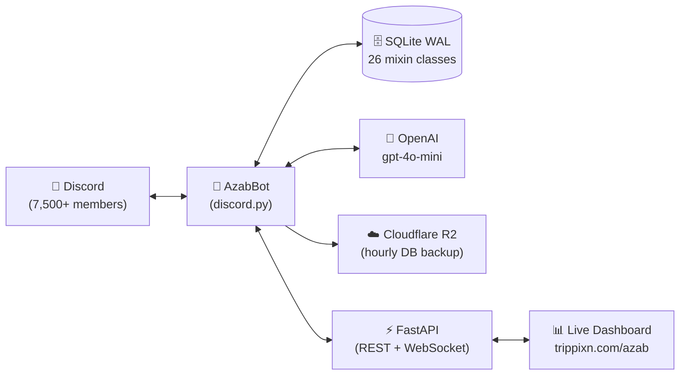

# AzabBot

**A production Discord moderation platform powering a 7,500+ member server.**

---

## What This Is

A real production moderation platform handling real incidents daily — not a tutorial, not a template. Built solo over hundreds of hours for the [Syria Discord](https://discord.gg/syria) server. Every feature exists because a real moderation problem required it.

This repository is a **curated portfolio mirror**. The full source is private; what you see in [`examples/`](examples/) are extracted, runnable-shape modules with the imports trimmed and the secrets stripped. They show the engineering, not the keys.

---

## At a Glance

| | |
|---|---|
| **Members served** | 7,500+ |
| **Source size** | ~30,000 LOC across 4 services + REST API |
| **Languages handled** | English + Arabic (with dialect awareness) |
| **Test coverage** | 1,015 tests passing, 1 skipped |
| **Uptime** | 99.9%+ on Hetzner VPS, hourly snapshots, R2 cloud backups |
| **Live dashboard** | [trippixn.com/azab](https://trippixn.com/azab) — real-time WebSocket events |

---

## Notable Engineering

A handful of non-obvious things this codebase does well. Each links to the curated source in [`examples/`](examples/).

### 1. The `auto_mute()` chokepoint
Every automated mute (antispam, sticker spam, external invites, off-platform messengers, AI content moderation) routes through one helper. DB write → role apply → audit log → dashboard event → forum case → DM with appeal button — same order, same shape, every time. Adding a new auto-mute surface is now a 5-line call site instead of 150 lines of copy-paste. → [`examples/antispam/`](examples/antispam/)

### 2. AI-gated ticket flow
A 3-question OpenAI greeter blocks moderators from claiming a ticket until the user has actually engaged — paired with a 1-hour fast-close path for ghost tickets. The gate ran in production for months before it caught the case described in [docs/ARCHITECTURE-NOTES.md](docs/ARCHITECTURE-NOTES.md). → [`examples/tickets/`](examples/tickets/)

### 3. Booster-priority "Talk to Staff" button
Users can skip the AI greeter and call a human directly — but the button is server-booster-only and renders a structured "Boost Priority Request" component with avatar, ticket subject, and AI summary. Non-boosters get a clean "this is a booster perk" ephemeral. → [`examples/tickets/`](examples/tickets/)

### 4. Dialect-aware content moderation
A custom OpenAI prompt handles Syrian/Arabic dialect ("والله", "يا الله", "صار اله لسان" — all dialect noise that generic AutoMod would shred). Three violation classes (religion debate, severe Arabic cursing, hate speech / threats) routed to per-class thresholds. Regex fast-path for known Arabic curse words avoids the API call. → [`examples/antispam/detectors.py`](examples/antispam/detectors.py)

### 5. Cross-server moderation
Mute / ban / warn work seamlessly between the main server and the staff server. They also work on users who *aren't currently in the server* — mutes are recorded in the database and re-applied on rejoin via a mute-evasion check. → [`examples/mute/`](examples/mute/)

### 6. Forum-based case management
Every moderation action creates a case forum thread with auto-tags (Mute / Ban / Warn / Resolved / Evasion), evidence galleries that survive Discord's 24-hour CDN expiry (re-uploaded to an assets channel and re-rendered on demand), and a Control Panel starter message with Edit / Unmute / Extend / Record buttons. → [`examples/case_log/`](examples/case_log/)

### 7. HTML transcript viewer
Every closed ticket archives to a public-link HTML transcript with avatars, timestamps, attachments, and per-message permanent URLs. Driven by an authenticated FastAPI route. → [`examples/tickets/html_generator.py`](examples/tickets/html_generator.py)

---

## Architecture

```mermaid
flowchart LR
  Discord["💬 Discord<br/>(7,500+ members)"]
  Bot["🤖 AzabBot<br/>(discord.py)"]
  DB[("🗄️ SQLite WAL<br/>26 mixin classes")]
  AI["🧠 OpenAI<br/>gpt-4o-mini"]
  R2["☁️ Cloudflare R2<br/>(hourly DB backup)"]
  API["⚡ FastAPI<br/>(REST + WebSocket)"]
  Dash["📊 Live Dashboard<br/>trippixn.com/azab"]

  Discord <--> Bot
  Bot <--> DB
  Bot <--> AI
  Bot --> R2
  Bot <--> API
  API <--> Dash
```

The bot is composed of independent services with clean boundaries:

| Layer | Responsibility |
|---|---|
| `core/` | Config, database (26 mixins), tree logger, event bus |
| `commands/` | Slash commands (mute, ban, warn, forbid, lockdown, snipe, animate, suggest, bug) |
| `handlers/` | 33-handler `on_message` pipeline + member / channel / audit-log events |
| `services/` | Independent modules — case_log, tickets, antispam, server_logs, mod_tracker, antinuke, raid_lockdown, content_moderation, server_backup, vc_logger, anime_clone, prisoner, appeals, maintenance, backup |
| `api/` | FastAPI routers (stats, cases, tickets, users, appeals, events) + WebSocket |
| `views/` | Reusable button factories + confirm-view base |

See [`docs/ARCHITECTURE-NOTES.md`](docs/ARCHITECTURE-NOTES.md) for the full house-style index, audit-trail citation format, and intentional patterns that look like bugs but aren't.

---

## Tech Stack

- **Python 3.12** with strict type hints, basic-mode pyright clean on recent surfaces
- **discord.py 2.7+** — Components v2 (LayoutView), DynamicItem-based persistent buttons
- **SQLite** in WAL mode with `sqlite3.backup()` for consistent snapshots, auto-repair via dump/restore
- **FastAPI** + WebSocket for the REST API and live dashboard event feed
- **OpenAI** `gpt-4o-mini` for ticket greeter + content moderation classifier
- **Cloudflare R2** for hourly DB backups with integrity checks
- **Hetzner VPS** + systemd, single-instance file lock with stale-lock detection
- **Cloudflare safe-browsing** for live URL scanning

---

## Code Examples

The [`examples/`](examples/) directory contains 8 curated subsystems lifted directly from the production codebase:

| Module | Lines | What it shows |
|---|---|---|
| [`antispam/`](examples/antispam/) | ~3,000 | Pattern detection, reputation scoring, Arabic-aware heuristics |
| [`case_log/`](examples/case_log/) | ~5,000 | Forum case management, tag automation, control panel views |
| [`tickets/`](examples/tickets/) | ~4,000 | Full ticket workflow, HTML transcripts, AI-gated claim flow |
| [`mute/`](examples/mute/) | ~1,500 | Cross-server moderation, absent-user mutes, buyout, XP drain |
| [`prison/`](examples/prison/) | ~1,500 | Welcome embed flow, anime clone, release path, appeal views |
| [`server_logs/`](examples/server_logs/) | ~2,500 | Audit logging, category routing, 20+ event types |
| [`database/`](examples/database/) | ~1,500 | Schema, migrations, mixin architecture |
| [`api/`](examples/api/) | ~1,000 | FastAPI lifespan, middleware, socket reuse |

Each subdirectory has its own `__init__.py` showing exports and a `README.md` explaining the design choices. **Imports reference the full `src/` tree which is not included** — these are reading material, not a runnable build.

---

## Why It's Closed Source

This isn't a hobbyist Discord bot. It's the moderation backbone of a 7,500+ member community with real users, real incidents, and real moderation policy that I don't want copy-pasted into someone else's harassment campaign. Publishing the full source — including detection thresholds, exemption ladders, and bypass mechanisms — would be a gift to bad actors.

The portfolio mirror exists so engineers, recruiters, and Discord-bot developers can read the code, see the engineering, and judge the work. **It is published for review only — see [`LICENSE`](LICENSE).**

---

## Ecosystem

AzabBot is one of **6 bots** built for [discord.gg/syria](https://discord.gg/syria):

| Bot | Role | Lines |
|---|---|---|
| **SyriaBot** | XP leveling, TempVoice, media tools | 25K+ |
| **AzabBot** | Moderation, cases, tickets, logging | 30K+ |
| **JawdatBot** | Casino economy, AI games | 15K+ |
| **OthmanBot** | News aggregation, community | 12K+ |
| **TahaBot** | 24/7 Quran streaming, prayer times | 8K+ |
| **TrippixnBot** | Developer tools, monitoring | 5K+ |

All 6 share a unified backup system, webhook logger, and deployment pipeline on a single Hetzner VPS.

---

**Built by [John Hamwi](https://github.com/trippixn963)** · [Live Server](https://discord.gg/syria) · [Live Dashboard](https://trippixn.com/azab)

