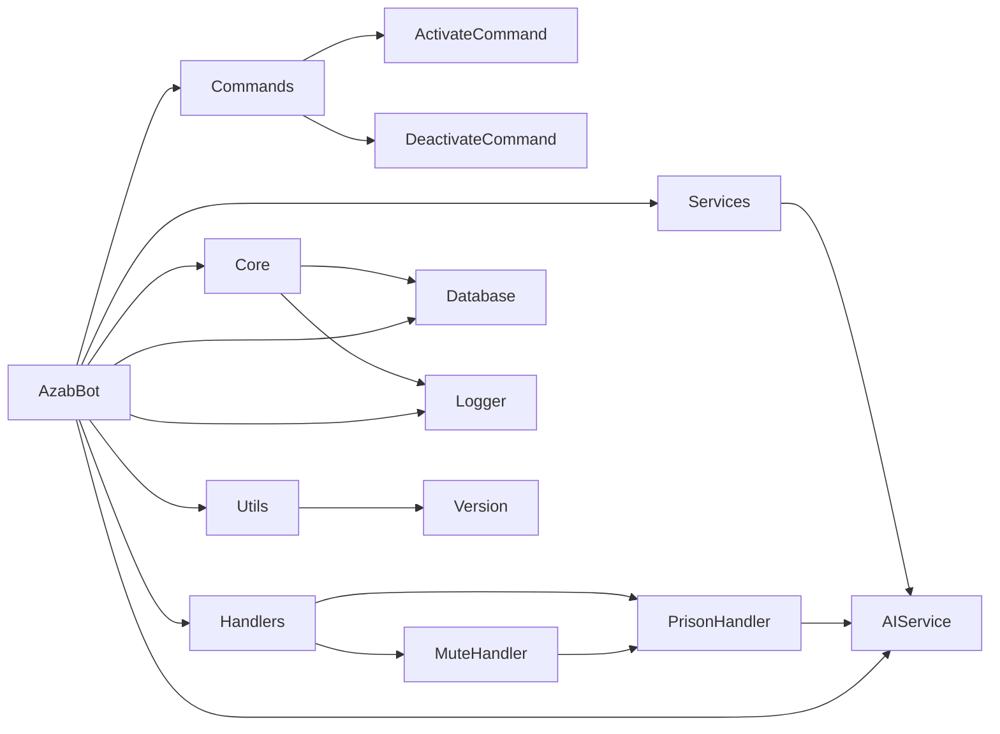

# 🔥 Azab - Advanced Discord Prison Bot

<div align="center">


**A sophisticated Discord bot designed for psychological warfare against muted users**

*Built specifically for discord.gg/syria*

[Features](#-features) • [Installation](#-installation) • [Configuration](#-configuration) • [Usage](#-usage) • [Architecture](#-architecture)

</div>

---

## 🎯 Overview

**Azab** is a custom-built Discord bot that specializes in advanced psychological warfare against muted users. Unlike traditional moderation bots, Azab doesn't mute users - it **ragebaits** them after they've already been muted by other systems.

### ⚠️ **Important Notice**
This bot was custom-built for **discord.gg/syria** and is provided as-is for educational purposes. **No support will be provided** for setup, configuration, or troubleshooting.

---

## ✨ Features

### 🧠 **AI-Powered Ragebaiting**
- **OpenAI Integration**: Uses GPT-3.5-turbo for contextual, creative responses
- **Contextual Mocking**: References specific mute reasons and user messages
- **Adaptive Responses**: Different response styles based on user status
- **Fallback System**: Works even without AI service

### 🔍 **Advanced Mute Detection**
- **Role-Based Detection**: Monitors for muted role assignments
- **Timeout Monitoring**: Tracks Discord timeout status changes
- **Embed Processing**: Extracts mute reasons from moderation bot embeds
- **Real-Time Tracking**: Instant detection of new prisoners

### 🏰 **Prison Management System**
- **Automatic Welcomes**: New prisoners get savage welcome messages
- **Channel Integration**: Monitors logs channel for mute information
- **Prison Channel**: Dedicated space for ragebaiting activities
- **Contextual Responses**: Uses actual mute reasons for maximum impact

### 📊 **Analytics & Logging**
- **Message Tracking**: Logs all user interactions to SQLite database
- **Run ID System**: Unique session tracking for debugging
- **Structured Logging**: Professional logging with EST timezone
- **Performance Monitoring**: Tracks bot performance and errors

### 🎮 **Command System**
- **Slash Commands**: Modern Discord slash command interface
- **Admin Controls**: `/activate` and `/deactivate` commands
- **Permission System**: Administrator-only access to controls
- **Ephemeral Responses**: Private command confirmations

---

## 🚀 Installation

### Prerequisites
- Python 3.11 or higher
- Discord Bot Token
- OpenAI API Key (optional but recommended)

### Quick Setup

1. **Clone the repository**
```bash
git clone https://github.com/trippixn963/AzabBot.git
cd AzabBot
```

2. **Create virtual environment**
```bash
python -m venv venv
source venv/bin/activate  # On Windows: venv\Scripts\activate
```

3. **Install dependencies**
```bash
pip install -r requirements.txt
```

4. **Configure environment**
```bash
cp .env.example .env
# Edit .env with your configuration
```

5. **Run the bot**
```bash
python main.py
```

---

## ⚙️ Configuration

### Environment Variables

Create a `.env` file in the project root:

```env
# Discord Configuration
DISCORD_TOKEN=your_discord_bot_token
DEVELOPER_ID=your_discord_user_id

# OpenAI Configuration (Optional)
OPENAI_API_KEY=your_openai_api_key

# Channel Configuration
LOGS_CHANNEL_ID=channel_id_for_moderation_logs
PRISON_CHANNEL_ID=channel_id_for_prison_messages
MUTED_ROLE_ID=role_id_for_muted_users

# Bot Behavior Settings
RESPONSE_PROBABILITY=70
AI_MODEL=gpt-3.5-turbo
MAX_RESPONSE_LENGTH=150
COOLDOWN_SECONDS=10
```

### Discord Bot Setup

1. **Create Discord Application**
   - Go to [Discord Developer Portal](https://discord.com/developers/applications)
   - Create new application
   - Go to "Bot" section and create bot
   - Copy the token to your `.env` file

2. **Set Bot Permissions**
   - Enable "Message Content Intent"
   - Enable "Server Members Intent"
   - Add bot to your server with appropriate permissions

3. **Configure Channels**
   - Set up logs channel for moderation bot embeds
   - Create prison channel for ragebaiting
   - Create muted role for user detection

---

## 🖼️ Visual Demo

<div align="center">

### Bot in Action


*The Azab bot ready to engage in psychological warfare*

</div>

---

## 🎮 Usage

### Basic Commands

| Command | Description | Permission |
|---------|-------------|------------|
| `/activate` | Enable ragebaiting mode | Administrator |
| `/deactivate` | Disable ragebaiting mode | Administrator |

### Bot Behavior

**When Active:**
- Monitors all messages for muted users
- Generates AI responses to muted users only
- Welcomes new prisoners with contextual messages
- Logs all interactions for analytics

**When Inactive:**
- Stays connected but doesn't respond
- Continues monitoring for new mutes
- Maintains database logging

### Example Interactions

```
User (muted): "This is so unfair!"
Azab: "Imagine getting muted and still complaining 😂 Welcome to prison, enjoy your stay! 🔒"

User (muted): "I didn't do anything wrong"
Azab: "That's what they all say in jail 💀 Maybe next time don't spam the chat?"
```

---

## 🏗️ Architecture

### Bot Workflow Diagram

```mermaid
graph TD
    A[Discord Message] --> B{Bot Active?}
    B -->|No| C[Ignore Message]
    B -->|Yes| D[Log to Database]
    D --> E{User Muted?}
    E -->|No| F[No Response]
    E -->|Yes| G[Check Mute Reason]
    G --> H[Generate AI Response]
    H --> I[Send Ragebait Reply]
    
    J[User Gets Muted] --> K[Detect Role Change]
    K --> L[Scan Logs Channel]
    L --> M[Extract Mute Reason]
    M --> N[Send Welcome to Prison]
    
    O[User Gets Unmuted] --> P[Detect Role Removal]
    P --> Q[Send Release Message]
    Q --> R[Clear Mute Reason]
    
    S[/activate Command] --> T[Enable Ragebaiting]
    U[/deactivate Command] --> V[Disable Ragebaiting]
```

### System Architecture



### Project Structure

```
azab-discord-bot/
├── src/
│   ├── bot.py                 # Main bot class and event handlers
│   ├── commands/
│   │   ├── activate.py        # /activate command
│   │   └── deactivate.py      # /deactivate command
│   ├── core/
│   │   ├── database.py        # SQLite database wrapper
│   │   └── logger.py          # Custom logging system
│   ├── services/
│   │   └── ai_service.py      # OpenAI integration
│   └── utils/
│       └── __init__.py        # Utility functions
├── data/
│   └── azab.db               # SQLite database
├── logs/
│   └── azab_YYYY-MM-DD.log   # Daily log files
├── .env                      # Environment configuration
├── main.py                   # Application entry point
└── requirements.txt          # Python dependencies
```

### Core Components

**AzabBot Class**
- Main Discord client with event handlers
- Mute detection and prison management
- AI response coordination

**AIService**
- OpenAI API integration
- Contextual response generation
- Fallback response system

**Database**
- SQLite for message logging
- User statistics tracking
- Async database operations

**Logger**
- Custom logging with run IDs
- EST timezone support
- Daily log rotation

---

## 🔧 Technical Details

### Dependencies

- **discord.py**: Discord API wrapper
- **openai**: AI response generation
- **python-dotenv**: Environment management
- **aiohttp**: Async HTTP client

### Performance Features

- **Async Operations**: Non-blocking database and API calls
- **Connection Pooling**: Efficient database connections
- **Error Handling**: Comprehensive error recovery
- **Resource Management**: Proper cleanup and shutdown

### Security Features

- **Permission Checks**: Administrator-only commands
- **Input Validation**: Safe message processing
- **Rate Limiting**: Prevents API abuse
- **Secure Configuration**: Environment-based secrets

---

## 📈 Monitoring & Analytics

### Logging System

- **Run ID Tracking**: Each session gets unique identifier
- **Structured Logs**: JSON-formatted log entries
- **Daily Rotation**: Automatic log file management
- **Error Tracking**: Comprehensive error logging

### Database Schema

```sql
-- Users table
CREATE TABLE users (
    user_id INTEGER PRIMARY KEY,
    username TEXT,
    messages_count INTEGER DEFAULT 0,
    is_imprisoned BOOLEAN DEFAULT 0
);

-- Messages table
CREATE TABLE messages (
    id INTEGER PRIMARY KEY AUTOINCREMENT,
    user_id INTEGER,
    content TEXT,
    channel_id INTEGER,
    guild_id INTEGER,
    timestamp TIMESTAMP DEFAULT CURRENT_TIMESTAMP
);
```

---

## ⚠️ Disclaimer

**This bot is provided for educational and entertainment purposes only.**

- **No Support**: This is a custom bot with no support provided
- **Use at Own Risk**: Not responsible for any consequences
- **Server-Specific**: Built for discord.gg/syria, may not work elsewhere
- **Moderation Tool**: Designed to work alongside existing moderation systems

---

## 📄 License

This project is licensed under the MIT License - see the [LICENSE](LICENSE) file for details.

---

## 👨‍💻 Author

<div align="center">


**حَـــــنَّـــــا** - Custom Discord Bot Developer

*Built with ❤️ for discord.gg/syria*

</div>

---

<div align="center">

**⭐ Star this repository if you find it interesting!**

[Report Bug](https://github.com/trippixn963/AzabBot/issues) • [Request Feature](https://github.com/trippixn963/AzabBot/issues) • [Discord Server](https://discord.gg/syria)

</div>